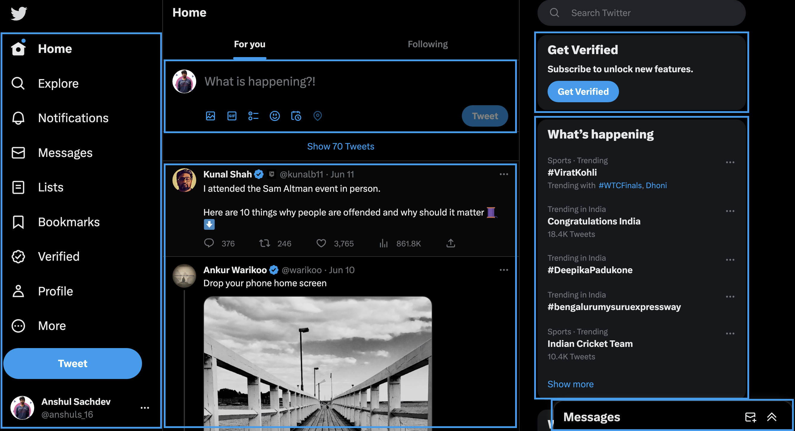
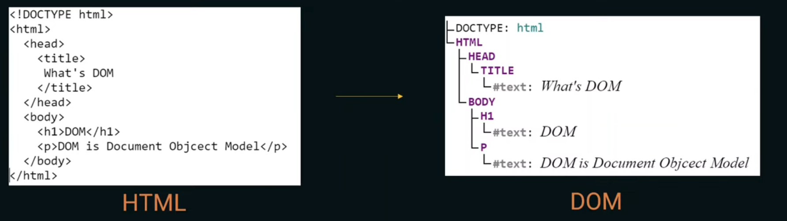
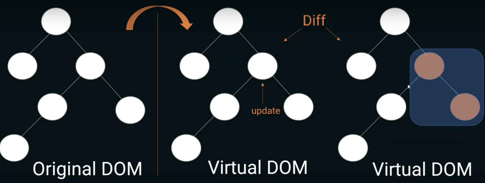

# ReactJs Session : PART-1

This session covers the basics of ReactJs.

---

### **Goal of the session**

The goal of this session is to gain an intuitive understanding of what React is all about so that you get comfortable with the basics.

### **Prerequisites**

- HTML
- CSS
- JavaScript

### **Motivation for learning ReactJs**

1. Easy Learning Curve
2. Lightweight Virtual DOM
3. Component Structure
4. Good Performance
5. Easy Debugging With React DevTools
6. Less Development Time
7. Low Development Cost
8. Active Community Support

### Let’s Dive In

- JS library
- Components



- JSX
- Babel
- Virtual DOM
    
    
    
    
    
- State
- Props

## Hello World ReactJs

```html
<html>
    <head>

    </head>
    <body>
        <h1>ReactJs Session : Part1</h1>
        <script crossorigin src="https://unpkg.com/react@18/umd/react.development.js"></script>
        <script crossorigin src="https://unpkg.com/react-dom@18/umd/react-dom.development.js"></script>
        <div id='root'></div>
        <script language="JavaScript"> 
            const root = ReactDOM.createRoot(document.getElementById('root')); 
            const element = React.createElement('h2', null, 'Hello World') 
            root.render(element);
         </script> 
    </body>
</html>
```

## Bringing JavaScript Files

index.html

```html
<html>
    <head>

    </head>
    <body>
        <h1>ReactJs Session : Part1</h1>
        <script crossorigin src="https://unpkg.com/react@18/umd/react.development.js"></script>
        <script crossorigin src="https://unpkg.com/react-dom@18/umd/react-dom.development.js"></script>
        <div id='root'></div>
        <script src="./index.js"></script>
    </body>
</html>
```

index.js

```jsx
const root = ReactDOM.createRoot(document.getElementById('root')); 
const element = React.createElement('h2', null, 'Hello World') 
root.render(element);
```

## Making first React Component

- live-server
- babel
- es6 and es7 features

index.html

```html
<html>
    <head>

    </head>
    <body>
        <h1>ReactJs Session : Part1</h1>
        <script crossorigin src="https://unpkg.com/react@18/umd/react.development.js"></script>
        <script crossorigin src="https://unpkg.com/react-dom@18/umd/react-dom.development.js"></script>
        <div id='root'></div>
        <script type="module" src="./index.js"></script>
    </body>
</html>
```

index.js

```jsx
const App = () => {
    return(
        <h2>Hello from functional component</h2>
    )
}

const root = ReactDOM.createRoot(document.getElementById('root')); 
const element = React.createElement('h2', null, 'Hello World') 
root.render(<App />);
```

**Demo App-**

- Counter App
- Multi components working together in a single screen (props)

### **Next steps?**

- [Component LifeCycle](https://legacy.reactjs.org/docs/react-component.html)
- [Functional vs Class-Components in React](https://medium.com/@Zwenza/functional-vs-class-components-in-react-231e3fbd7108)
- [Named Export vs Default Export in ES6](https://medium.com/@etherealm/named-export-vs-default-export-in-es6-affb483a0910)
- [Hooks](https://www.w3schools.com/react/react_hooks.asp) - useState, useEffect, useRef, etc.
- [React Router](https://www.w3schools.com/react/react_router.asp) [ to manage Routing ]
- [TypeScript](https://www.typescriptlang.org/)
- Actions / Reducers
- [Webpack](https://webpack.js.org/concepts/)

### Some useful resources

- [10 React Starter Project Ideas to Get You Coding](https://medium.com/@dtkatz/10-react-starter-project-ideas-to-get-you-coding-5b35782e1831)
- [React Best practices](https://www.makeuseof.com/must-follow-react-practices/)
- [CSS Tutorial - Zero to Hero (Complete Course)](https://youtu.be/1Rs2ND1ryYc)
- **JavaScript Topics**
    - JavaScript is an object based scripting language, that is used to make websites dynamic and interactive.
    - [Scopes](https://www.freecodecamp.org/news/var-let-and-const-whats-the-difference/#:~:text=var%20declarations%20are%20globally%20scoped%20or%20function%20scoped%20while%20let,the%20top%20of%20their%20scope.) - let, var and const and Problems with VAR
    - **[JavaScript Functions](https://www.youtube.com/watch?v=uxkRydQKKX8&list=PL7TLF4T4Tq2TtNmadzRfxYIB9683uhpbD&index=34)**
        - **[Callback Functions](https://www.notion.so/ReactJs-Session-PART-1-3e749cbaf5294bc789ed7f87b5705955?pvs=21)** - In JavaScript there are higher order methods and functions that accept a function as an argument. These functions used as arguments for other functions are called callback functions.
        - **[Arrow Functions](https://www.youtube.com/watch?v=Oy185MF8pnY&list=PL7TLF4T4Tq2TtNmadzRfxYIB9683uhpbD&index=46)** - They provide a new and shorter way to write anonymous function expressions. They are always anonymous. They don't have their own 'this' binding. It is determined by the surrounding scope.
        - **[Pure functions](https://www.youtube.com/watch?v=x9Cy-N22uvQ&list=PL7TLF4T4Tq2TtNmadzRfxYIB9683uhpbD&index=49)** - A function that for some given arguments always produces the same outcome and one that has no side effects.
        - **[Higher Order functions](https://www.youtube.com/watch?v=9E8Ih8sVy3M&list=PL7TLF4T4Tq2TtNmadzRfxYIB9683uhpbD&index=48)** - A function that receives another function as an argument or that returns a new function or both is called Higher-order function. Ex- setTimeout(fun, 2000)
    - [**setTimeout() and setInterval()**](https://www.youtube.com/watch?v=0ewbT5YJdR8&list=PL7TLF4T4Tq2TtNmadzRfxYIB9683uhpbD&index=47)
    - [JavaScript Loading Strategies (async and defer)](https://youtu.be/GoEBQCp2Nzg)
    - [**Axios**](https://www.youtube.com/watch?v=6LyagkoRWYA)
    - [Hoisting in JS](https://www.youtube.com/watch?v=QEayOiHzrFM&list=PL7TLF4T4Tq2TtNmadzRfxYIB9683uhpbD&index=40) - Hoisting is Javascript’s default behaviour where Variable and function declarations are moved to the top of their scope before code execution.
    - [Spread operator](https://www.youtube.com/watch?v=AN0oTuWdLtk&list=PL7TLF4T4Tq2TtNmadzRfxYIB9683uhpbD&index=44)
    - **[Promise](https://www.youtube.com/watch?v=DHvZLI7Db8E)**
        - **[Promise Chaining](https://developer.mozilla.org/en-US/docs/Web/JavaScript/Guide/Using_promises#chaining)**
        - [**Using Promises**](https://developer.mozilla.org/en-US/docs/Web/JavaScript/Guide/Using_promises)
        - **[Promise Composition](https://developer.mozilla.org/en-US/docs/Web/JavaScript/Guide/Using_promises#composition)** - Promise.all(), Promise.allSettled(), Promise.any(), Promise.race()
    - [**Method binding**](https://drive.google.com/drive/u/4/folders/1U47XZVKe07PHegrCQayfVCn0PX9_wHbj)
    - [**Async / Await**](https://developer.mozilla.org/en-US/docs/Web/JavaScript/Reference/Statements/async_function)
    - [**Web Component**](https://www.youtube.com/watch?v=PCWaFLy3VUo)

---

# Thank You ✨
